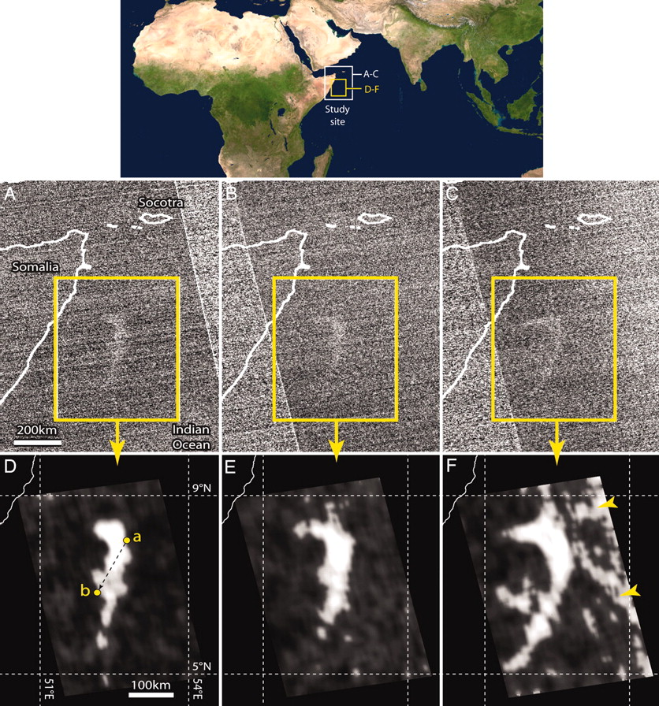

# Milky Seas: Haunted Oceans or Biological Mystery

## Directory

[Plain Language Summary](#plain-language-summary)

[Scientific Overview](#scientific-summary)

[First Hand Accounts](#first-hand-accounts)

[Animated Figures From Poster](#animated-figures-from-poster)

[References](#references)

## Plain Language Summary

Bioluminescence (the ability of living beings to emit light) comes in many forms, some examples would be the glow emitted by fireflies, the lure of an anglerfish, and even some types of jellyfish. All of these types of bioluminescence happen quickly, fractions of a second to maybe a couple minutes and are limited to the area immediately around whatever is emitting the light.

Milky Seas are a rare form of bioluminescence where the ocean will glow for days to months at a time over a region hundreds of miles wide. This phenomena has captured the imagination of scientists, sailors, explorers, and writers for hundreds of years. Jules Verne wrote this about them in his classic novel ***20,000 Leagues Under The Sea*** in 1869:

> Near seven o'clock in the evening, the Nautilus lay half submerged, navigating
in the midst of milky white waves. As far as the eye could see, the ocean
seemed lactified. Was it an effect of the moon's rays? No, because the new moon
was barely two days old and was still lost below the horizon in the sun's rays.
The entire sky, although lit up by stellar radiation, seemed pitch–black in 
comparison with the whiteness of these waters.

> Conseil couldn't believe his eyes, and he questioned me about the causes of this odd phenomenon. Luckily I was in a position to answer him.

> "That's called a milk sea," I told him, "a vast expanse of white waves often seen along the coasts of Amboina and in these waterways."

While some have viewed this phenomena as a fantastical sight others viewed it as an omen of the end times such as Capt. Kingman of the *Shooting Star* during his encounter with a Milky Sea in 1854:

> The whole appearance of the ocean was like a plain covered with snow. There was scarce a cloud in the heavens, yet the sky (...) appeared as black as if a storm was raging (...) The scene was one of awful grandeur; the sea having turned to phosphorous, and the heavens being hung in blackness, and the stars going out, seemed to indicate that all nature was preparing for that last grand conflagration which we are taught to believe is to annihilate this material world.

Below are some photos taken by the crew of the yacht *Ganesha* in 2019, the only known people to have ever photographed a Milky Sea from a boat. Everything in these photos is illuminated by the Milky Sea they were passing through. Typically being out on the open ocean at night is incredibly dark with the only light being the moon and stars above, and it is no surprise people have been astonished by the sight of the ocean suddenly glowing so bright that people have been able to read books with nothing but the light of the ocean.

|  |
| :--: |
| |

Nowadays we know that Milky Seas are one of the largest biological phenomena on Earth. Despite their size the leading theory is that they are caused by large numbers of bacteria that live in the ocean. When enough of these bacteria are packed together in a small enough area they begin to glow. 

## Scientific Summary

Milky Seas are a rare phenomena wherein the ocean surface is illuminated for days to months at a time over areas up to 100,000+ km2. The typical eye-witness account of Milky Seas describes the ocean surface glowing from horizon to horizon a whitish-green hue. The leading theory on Milky Seas is that they are biological in origin, caused by bacteria at critical population densities to achieve quorum sensing over large areas. Below is a Stommel-diagram type comparison between Milky Seas and other forms of bioluminescence.

|  |
| :--: |
| Comparison between Milky Seas and other types of Bioluminescence. Milky Seas occur over spatial and temporal scales larger than any other type of bioluminescence. The hatched ellipses are macroscopic behavior of the organisms in the similarly colored ellipse. |

|  |
| :--: |
| Global distribution of Milky Sea sightings as reported in Herring and Watson 1993. The Majority of events occur in the northwest Indian Ocean as well as around the Maritime Continent region. Figure taken from [Herring and Watson 1993](https://digital.nmla.metoffice.gov.uk/IO_57f40079-b930-4213-a29c-fcf84951ff11/). |

There has been scientific literature on Milky Seas published in English since at least 1772 ([Newland 1772](https://royalsocietypublishing.org/doi/10.1098/rstl.1772.0014)). Between 1772 and 1993 scientific understanding of Milky Seas advanced little beyond noting its likely biological origin and they occur largely in and around the Indian Ocean during the monsoon seasons. In 2005 it was shown that Milky Seas cast such a large and stable glow that space-borne low-light imagers, in this case the Defense Meteorlogical Satellite Program's Operational Line Scanner (DMSP OLS), can view them from space. 

|  |
| :--: |
| The original Milky Sea detection from a low light imager, in this case the Defense Meteorological Satellite Program's Operational Line Scanner (DMSP OLS). Panels A-C show unfiltered DMSP OLS imagery and panels D-F show those same images but filtered and zoomed in. Taken from [Miller et al. 2005.](https://www.pnas.org/doi/10.1073/pnas.2207612119) |

While the DMSP OLS was capable of viewing Milky Seas it was under favorable conditions and knowing when and where to look based on in-situ encounters. The Visual Infrared Radiometer Suite's (VIIRS) Day/Night Band (DNB), the next generation of low-light imager, greatly expanded the ability to locate and study Milky Seas remotely following its launch in 2011 aboard the satellite Suomi-NPP. Although like its predecessor the VIIRS DNB can only view Milky Seas during time periods where the moon's illumination is relatively low (typically within 7-8 days of the new moon phase of its cycle).

With the expanded ability to locate and study Milky Seas [Miller et al. 2011](https://www.nature.com/articles/s41598-021-94823-z)

## First Hand Accounts

**Reporter:** Capt. Newland (Kelfall)

**Source:** *Observations on the Milky Appearance of Some Spots of Water in the Sea; By the Same*

**Date:** August, 1769

**Location:** Near Socotra

**Account:** (...) I discovered all of a sudden, about 8 o'clock in the evening, the water all round me as white as milk (intermixed with streaks or serpentine lines of black water). I immediately drew a bucket of it, and carried it to the light, where it appeared just as other water; I drew several more, and found it the same (...) The next evening about 7 o'clock the water appeared again as white as before.

---

**Reporter:** Capt. Kingman (Shooting Star)

**Source:** *Herring and Watson 1993, Milky Seas: A Bioluminescent Puzzle*

**Date:** 1854

**Location:** South of Java

**Account:** The whole appearance of the ocean was like a plain covered with snow. There was scarce a cloud in the heavens, yet the sky (...) appeared as black as if a storm was raging (...) The scene was one of awful grandeur; the sea having turned to phosphorous, and the heavens being hung in blackness, and the stars going out, seemed to indicate that all nature was preparing for that last grand conflagration which we are taught to believe is to annihilate this material world.

---

**Reporter:** Capt. Raphael Semmes (CSS Alabama)

**Source:** *Memoirs of Service Afloat, During the War Between the States*, p. 732

**Date:** January 30th, 1864

**Location:** Somalia ~(2.72N, 51E)

**Account:** At about eight P.M., there being no moon, but the sky being clear, and the stars shining brightly, we suddenly passed from the deep blue water in which we had been sailing, into a patch of water so white that it startled me; so much did it appear like a shoal. (...) The patch was extensive. We were several hours in running through it. Around the horizon there was a subdued glare, or flush, as though there were a distant illumination going on, whilst overhead there was a lurid, dark sky, in which the stars paled. The whole face of nature seemed changed, and with but little stretch of the imagination, the *Alabama* might have been conceived to be a phantom ship, lighted up by the sickly and unearthly glare of a phantom sea, and gliding on under the pale stars one knew not whither.

---

**Reporter:** Capt. I. L. Stout (S.S. Rhexenor)

**Source:** *Smith 1931, Phosphorescence of the Sea*

**Date:** August 12th, 1928 ~8 p.m. local time until ~4 a.m. local time

**Location:** Socotra ~(12.5N, 54.5E)

**Account:** The whole of the sea from horizon to horizon became frequently covered with a milky appearance. Although a sea and swell of force 6 [large wind driven waves] and a wind of S.W. force 7 [~35 miles per hour] was the weather at the time, the sea dropped to a calm and the swell diminished considerably, yet the wind remained the same, whilst the vessel was in these patches.

---

**Reporter:** Capt. J. Hatfield (S.S. Laomedon)

**Source:** *Smith 1931, Phosphorescence of the Sea*

**Date:** July 31st, 1929

**Location:** 12.36N, 56.46E

**Account:** Wind S.S.W. force 6 [~28 miles per hour], with rough sea and swell; at 19.00 when darkness set in, the ship appeared to be surrounded by a luminous halo reflected frm the water. By 20.00 the water had turned a greyish white colour which, however, did not appear to be caused by surface phosphorescence as there was little or no sparkle from the bow wave. This discolouration extended to the horizon in all directions giving it a misty appearance except between S.S.E. and W.S.W. where the horizon remained clearly defined. This phenomenon continued until 21.50 when it gradually closed in round the ship again and finally disappeared leavin the sea a normal colour with no phosphorescence. While the ship was in this discoloured water, the sea appeared to calm down considerably though the wind remained force 6.

---

**Reporter:** Anonymous, US Navy (USN)

**Source:** *Miller et al. 2021, Honing in on Bioluminescent Milky Seas from Space*

**Date:** 1968, Midnight-4 A.M. Local Time

**Location:** Azuero Peninsula, Panama, Pacific Side ~(7.0N, 80.7W)

**Account:** About a mile from me off to starboard, the sea was suddenly so bright and glowing that it attracted my attention. The glow just kept growing larger, and it was soon apparent that it would engulf the sea in front of my bow, even though I was moving away at 10 knots. The milky glow expanded and got beneath our hull and kept right on growing. From at least a mile to starboard of us and to a mile to port from us, the sea in all directions was glowing. We just drifted for about 30 minutes with this glow beneath us. We hauled in a few buckets of water, to see what we could see, but nothing special. Then it started to dim, and in about 5 minutes it was no longer glowing at all. It didn't move off; it just turned itself off.

---

**Reporter:** Lt. Chris Tolton & Reid Hinson, both Retired US Navy

**Source:** *Miller et al. 2021, Honing in on Bioluminescent Milky Seas from Space*

**Date:** Late May - Early June 1980, ~7:30-11:30 PM Local Time

**Location:** Arabian Sea, near Socotra

**Account:** Tolton: (At) about 1930-2030 hrs, Reid Hinson announced something unusual out on the seas. Much of the crew went out on deck and we were amazed at what we saw. It was night already and dark. It was like we were in the *"Twilight Zone"* and peering at a negative of the real world. The seas were glowing with phosphorescence as far as you could see all around us. The ship was darker than the seas, the sky was darker than the seas (normally the seas are the darkest of all). The phosphorescence was uniform and a bit lighter green or "whiter" than the normal screw-generated green phosphorescence (kind of like the glow-in-the-dark plastic stars you can buy your kids). There were no breaks in the phosphorescence even with the waves, i.e., I didn't see any "holes" of dark water but the wave foam was dark against the glowing water. I don't know how deep it went, but it appeared to be deeper than just the surface water - more than several yards deep.

---

**Reporter:** CDR Thomas Evanoff (Retired US Navy)

**Source:** *Miller et al. 2021, Honing in on Bioluminescent Milky Seas from Space*

**Date:** ~April - June 1990

**Location:** Indian Ocean near Equator, east of Africa near Seychelles

**Account:** (The milky sea) went on for miles. It was so bright I could read my notebook while standing on the bridge wing. At the time, I was the ship's navigator and happened to have the deck watch that night. It was so unusual, I remember calling the Captain and having some crewman come up from below deck to observe.

---

**Reporter:** Joyce and Don Green (private mariners of the yachy *Windy Thoughts*)

**Source:** *Miller et al. 2021, Honing in on Bioluminescent Milky Seas from Space*

**Date:** First week of August 1991

**Location:** Off coast of New Guinea, Arafura Sea ~(10S, 135E)

**Account:** Suddenly, my senses were overcome with the most astounding sight! The sea was alive with a vast bright green glow of bioluminescence that was often experienced in the boat's wake---but this was an entirely new phenomenon. *Windy Thoughts* sailed into a sea that was literally alight from horizon to horizon with a bright luminous green glow as far as the eye could see. Amazingly, the sky around us was aglow as well. All was dead quiet, the wind and seas calmed considerably. And yet our speed increased as *Windy Thoughts* sailed along in silence, not a sound of a wave breaking on her hull, not even the sound of the bow wave as she cut through the water---and not a whisper of wind was heard. It was surreal.

## Animated Figures From Poster

## References

