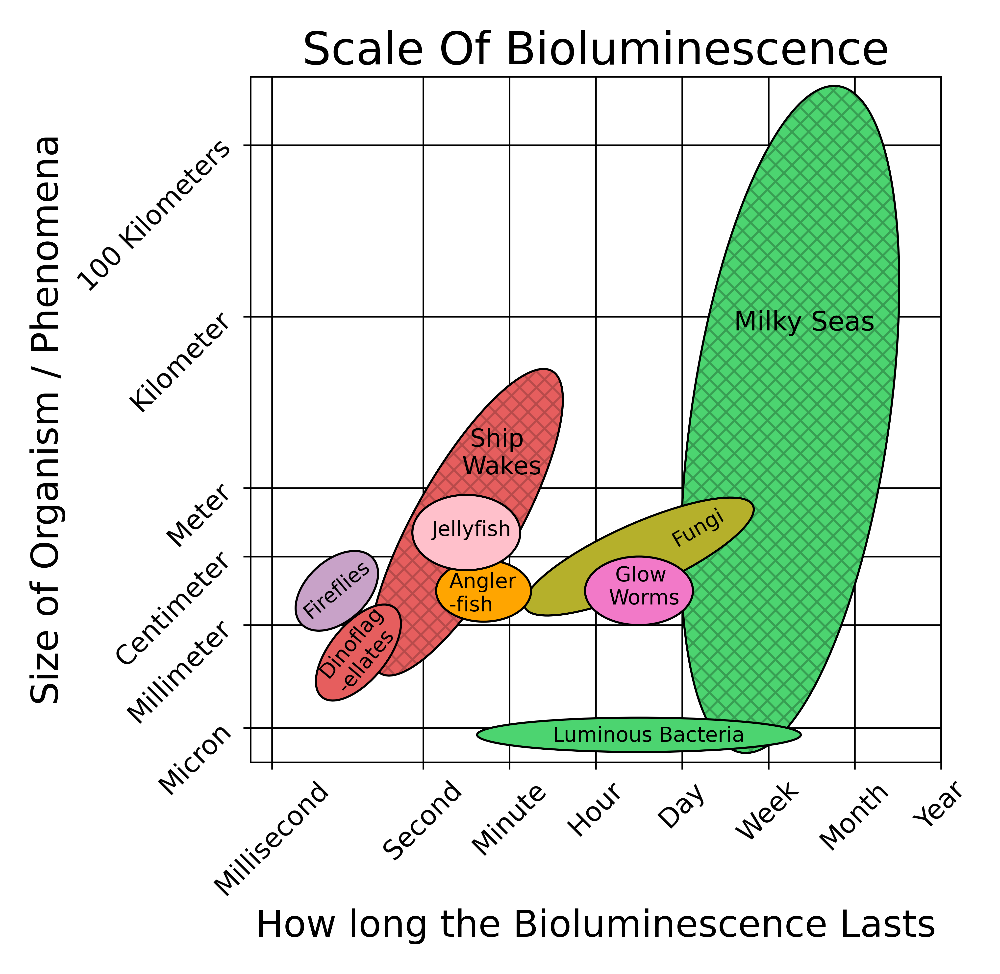
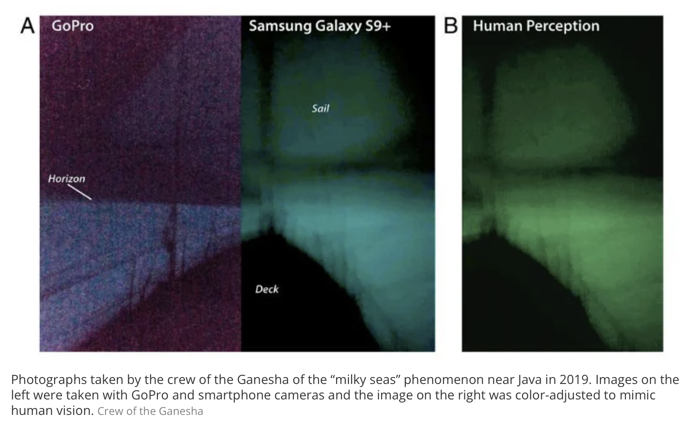
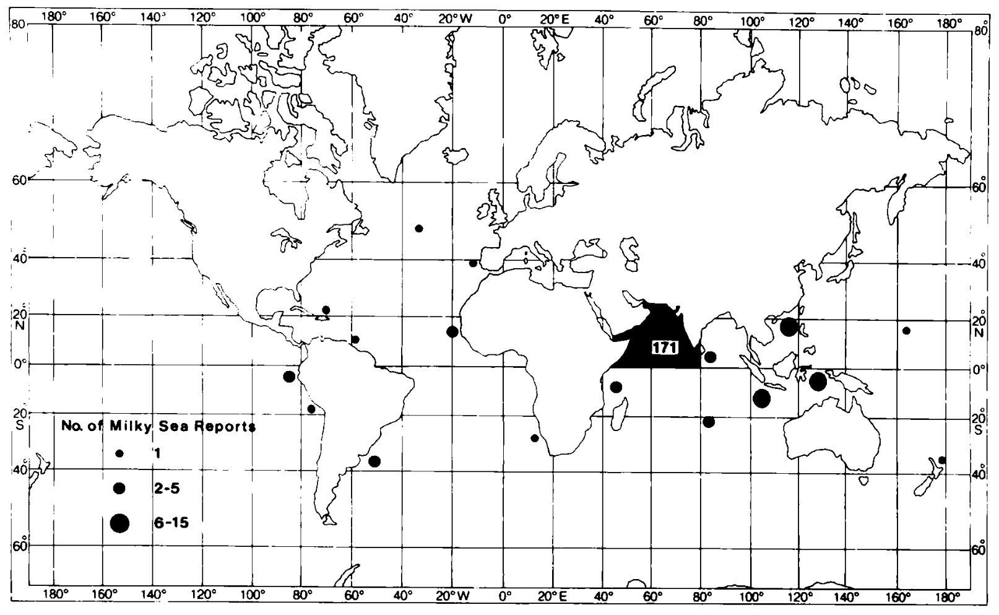
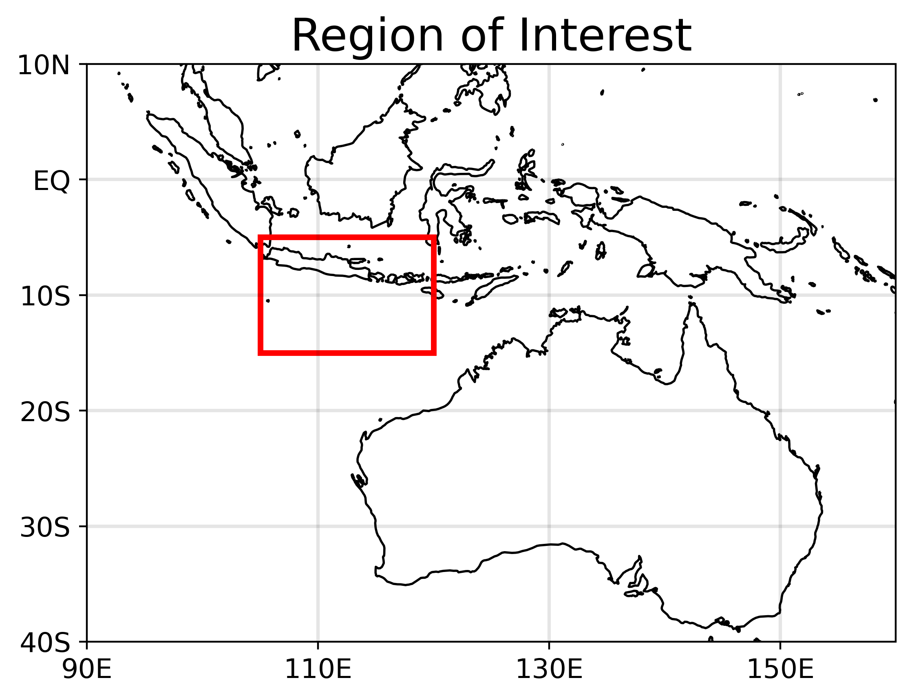
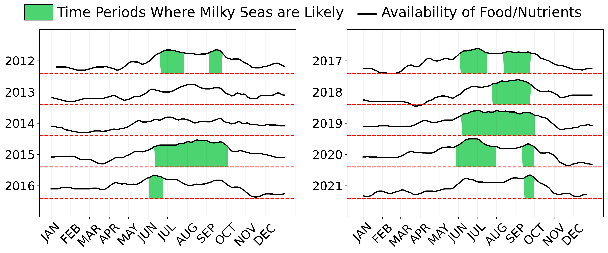
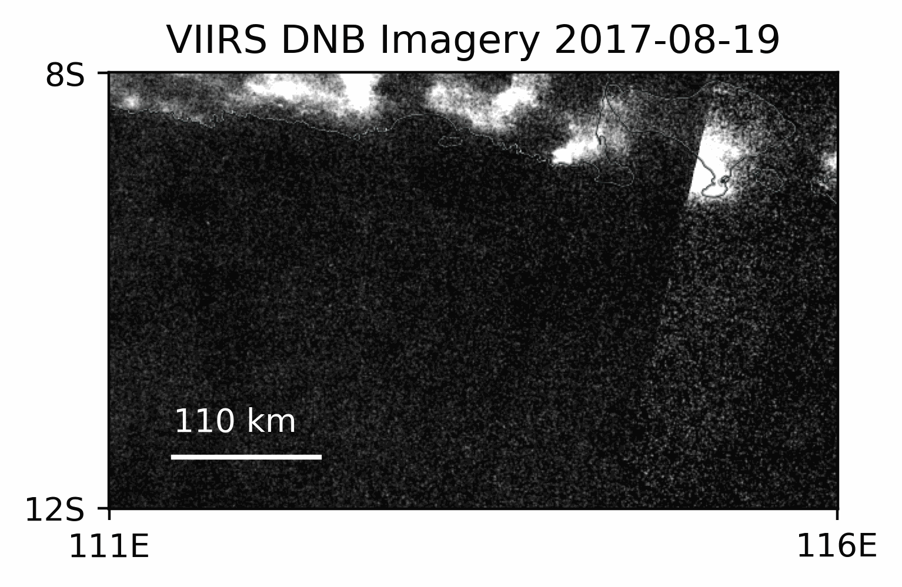
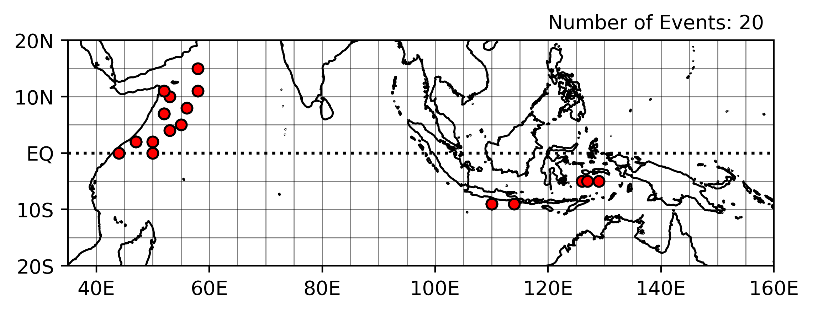
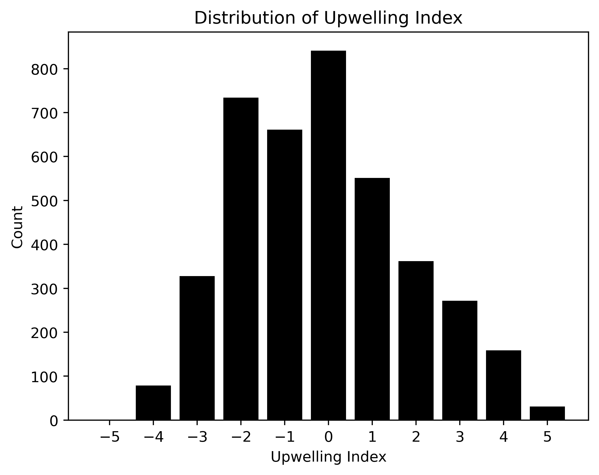

# Milky Seas: Haunted Oceans or Biological Mystery

## Directory

[Additional Information (Plain Language)](#additional-info-plain-language)

[Additional Information (For Scientists)](#additional-info-for-scientists)

[First Hand Accounts](#first-hand-accounts)

[Figures From Poster](#figures-from-poster)

[References](#references)

## Additional Info (Plain Language)

Bioluminescence (the ability of living beings to emit light) comes in many shapes and forms across nature such as fireflies, glowing mushrooms, and the lure of an anglerfish. One of the largest and most mysterious forms of bioluminescence are Milky Seas, a rare form of bioluminescence where the ocean can glow for days to months at a time over areas the size of the states of New York or Pennsylvania.

Despite their massive size Milky Seas are believed to be caused by bacteria, some of the smallest organisms on Earth. The ocean is full of bacteria and some of these bacteria, when there is enough of them present in a small enough area, bioluminesce. This bacterial bioluminescence can be maintained in laboratory settings for days to weeks at a time, and in nature possibly months.

|  |
| :--: |
| 
Comparison between Milky Seas and other types of Bioluminescence. The hatched ovals are types of bioluminescence believed to be caused by the organisms in the similarly colored ovals.
 |

Milky Seas have been written about as a fantastical sight, haunted oceans, and the coming of the apocalypse. Jules Verne wrote this about them in his classic novel ***20,000 Leagues Under The Sea*** in 1869:

> Near seven o'clock in the evening, the Nautilus lay half submerged, navigating
in the midst of milky white waves. As far as the eye could see, the ocean
seemed lactified. Was it an effect of the moon's rays? No, because the new moon
was barely two days old and was still lost below the horizon in the sun's rays.
The entire sky, although lit up by stellar radiation, seemed pitch–black in 
comparison with the whiteness of these waters.

> Conseil couldn't believe his eyes, and he questioned me about the causes of this odd phenomenon. Luckily I was in a position to answer him.

> "That's called a milk sea," I told him, "a vast expanse of white waves often seen along the coasts of Amboina and in these waterways."

> "But, sir," said Conseil, "can you tell me what causes such an effect? for I suppose the water is not really turned into milk."

> "No, my boy; and the whiteness which surprises you is caused only by the presence of myriads of infusoria, a sort of luminous little worm, gelatinous and without colour, of the thickness of a hair, and whose length is not more than seven-thousandths of an inch. These insects adhere to one another sometimes for several leagues."

> "Several leagues!" exclaimed Conseil.

> "Yes, my boy; and you need not try to compute the number of these infusoria. You will not be able, for, if I am not mistaken, ships have floated on these milk seas for more than forty miles."

> Towards midnight the sea suddenly resumes its usual colour; but behind us, even to the limites of the horizon, the sky reflected the whitened waves, and for a long time seemed impregnated with the vague glimmerings of an aurora borealis.

Captain Kingman of the *Shooting Star* wrote about his 1854 encounter with a Milky Sea in very different terms than Jules Verne however:

> The whole appearance of the ocean was like a plain covered with snow. There was scarce a cloud in the heavens, yet the sky (...) appeared as black as if a storm was raging (...) The scene was one of awful grandeur; the sea having turned to phosphorous, and the heavens being hung in blackness, and the stars going out, seemed to indicate that all nature was preparing for that last grand conflagration which we are taught to believe is to annihilate this material world.

Captain Kingman's account relays an imporant feature of Milky Seas, how bright they are. Typically when you're out on a boat in the middle of the ocean at night the only light source aside from the moon and stars is whatever you brought with you. Many eye-witness accounts of Milky Seas have reported the light coming from the ocean being so bright that they could no longer see the stars in the night sky and that it was possible to read books on the deck of the ship with nothing but the light of ocean around them to light up the night.

In 2019 the crew of the yacht *Ganesha* took the only known photos of a Milky Sea, and these photos (shown below) reveal just how bright Milky Seas can be. Everything in those photos is illuminated by the glowing ocean surrounding the *Ganesha*.

|  |
| :--: |
| |

Milky Seas are actually so bright that they are visible from space using special low-light cameras mounted on satellites, such as the VIIRS Day/Night Band (DNB). Historically all knowledge of Milky Seas has come from random encounters by ships, but with recent advances in satellite technology the ability to study Milky Seas has greatly expanded. We can now measure the true size of Milky Sea events as well as understand how long they really last.

|  |
| :--: |
| 
Satellite imagery of a Milky Sea event that happened near Java (an island NW of Australia) in the summer of 2019. This Milky Sea lasted until at least mid-September and was 100,000+ km2 in size, approximately the size of Pennsylvania. It disappears at the end of the loop due to the moon being so bright the satellite can no longer detect the Milky Sea. The images are taken from NASA Worldview. 
 |

With the power of modern technology and the hard work of researchers in the past who carefully catalogued ship encounters with Milky Seas we have an idea of when and where they occur. Most Milky Seas happen in the northern Indian Ocean between Somalia and India or within the Maritime Continent, the large islands just north of Australia. Our satellite based cameras do have the drawback that they cannot see Milky Seas when the moon is close to being full, the light of the moon is so bright it outshines the light being emitted by the ocean.

|  |
| :--: |
| 
Distribution of Milky Sea sightings by british sailors in the 20th century, taken from [Herring and Watson 1993](https://digital.nmla.metoffice.gov.uk/IO_57f40079-b930-4213-a29c-fcf84951ff11/)
 |

From both historical and modern attempts to catalogue Milky Seas we know that Milky Seas are quite rare, with typically only 1 Milky Sea happening a year around the globe. Because of this any attempt to study Milky Seas in person requires a way to predict when and where the next Milky Sea will occur.

In order to predict Milky Seas when we know little about them other than when and where they typically occur we have to make some assumptions. Because Milky Seas are so large we assumed that they occur when the availability of food and nutrients is high. In the ocean the availability of food and nutrients is usually controlled by how close to land you are, the weather, and the behavior of the ocean itself.

Because the interactions between the atmosphere and the ocean which control the availability of food and nutrients can be quite complex and vary depending upon where you are interested in working them out we decided to focus on a single region, namely the waters just south of the island of Java (an island NW of Austrlia and highlighted on the map below).

|  |
| :--: |
| 
Region of predictions/interest. Java, the large island that takes up most of the northern edge of the red box is a historical hot spot of Milky Sea encounters and is the location of the largest and longest lasting Milky Sea we know about. 
 |

Using known relationships between the atmosphere, ocean, and biology we built a simple predictive model for our region of interest. As the first predictive model for Milky Seas it was intentionally kept simple, if a weather pattern or ocean system was in the right state to increase the availability of food and nutrients in our region of interest the predicted availability of food went up, if a weather pattern or ocean system was in the wrong state the predicted availability of food went down. 

This model would assign individual days a number between -5 and 5 with the higher the number the higher the predicted food and nutrient availability. We then chose the time periods where the model assigned a value of 3 or greater to multiple days in a row from 2012-2021, this ended up being the top 15% of days. We classified these days are time periods where Milky Seas are likely.

|  |
| :--: |
| 
 The time periods predicted by our model as having a high likelihood of a Milky Sea occurring. A 20-day smooth was applied to the time series data. 
 |

Using our model we get 11 time periods where Milky Seas are likely near Java between 2012 and 2021. The model correctly predicted the only known Milky Sea that occurred near Java over this time period, July-September of 2019. Based on these results the satellite imagery was manually reexamined and in doing so a new Milky Sea event was found in late August 2017 (Aug 20th-27th).

|  |
| :--: |
| 
 VIIRS DNB imagery of the Milky Sea event discovered in August 2017 based on the predictions of our model. The event is outlined with a red box for clarity. 
 |

**This is the first time a Milky Sea has ever been successfully predicted rather than found through a random encounter or manually examining satellite imagery in the hope of finding one.** This prediction is an important first step towards planning an expedition out to a Milky Sea to sample the waters and better understand this phenomena which has fascinated people for hundreds if not thousands of years.

### [Click Me To Read Eyewitness Accounts of Milky Seas](#first-hand-accounts)

## Additional Info (For Scientists)

Milky Seas are a rare phenomena wherein the ocean surface is illuminated for days to months at a time over areas up to 100,000+ km2. The typical eye-witness account of Milky Seas describes the ocean surface glowing from horizon to horizon a whitish to green hue. The leading theory on Milky Seas is that they are biological in origin, caused by bacteria at critical population densities to achieve quorum sensing over large areas. Below is a Stommel-diagram type comparison between Milky Seas and other forms of bioluminescence.

|  |
| :--: |
| 
Comparison between Milky Seas and other types of Bioluminescence. Milky Seas occur over spatial and temporal scales larger than any other type of bioluminescence. The hatched ellipses are macroscopic behavior of the organisms in the similarly colored ellipse. 
 |

Milky Seas typically occur within the northwest Indian Ocean and Maritime Continent regions, although there have been eye-witness accounts all across the tropics and a few in the mid-latitude oceans. The Milky Sea sightings within the Indian Ocean basin are strongly linked to the monsoons of the region, commonly occurring during time periods and in regions where moonsoon driven upwelling is at a maximum.

|  |
| :--: |
| 
Geographic distribution of historical Milky Sea sightings as reported in Herring and Watson 1993. The Majority of events occur in the northwest Indian Ocean as well as around the Maritime Continent region. Figure taken from [Herring and Watson 1993](https://digital.nmla.metoffice.gov.uk/IO_57f40079-b930-4213-a29c-fcf84951ff11/).
 |
|  |
| 
 Geographic distribution of Milky Seas viewed with the low-light imagers aboard satellites. As with the historical distribution of eye-witness accounts they are located in and around the northwest Indian Ocean and the Maritime Continent region. Each red circle is an individual Milky Sea event. |

The knowledge that Milky Seas are caused by bacterial bioluminescence and are connected to the monsoons of the Indian Ocean have been known since at least 1899 (Bernard 1899). Since then very little new information regarding Milky Seas has been discovered, save that due to how bright and large they are Milky Seas are visible via low-light imagers aboard satellites (Miller et al. 2005, Miller et al. 2021) such as the Visual Infrared Radiometer Suite (VIIRS) Day/Night Band (DNB). 

While low-light imagers have greatly expanded the ability to study Milky Seas they are currently unable to see Milky Seas during time periods where the moon's illumination of the scene is high. This limits their usage to usually a 7 days before or after a new moon (about 50% of the lunar cycle). Similarly because the radiation emitted by Milky Seas is close to the noise floor of the VIIRS DNB they can be difficult to locate in non-nadir pixels. When accounting for cloud cover a sizeable fraction of Milky Sea events may be unobservable to low-light imagers.

|  |
| :--: |
| 
 VIIRS DNB imagery of a Milky Sea that occurred near Java during July-September 2019.  
 |

There are many open questions regarding Milky Seas, namely which specific organism drives the luminescence, what are the prevailing water characteristics in which they form, at what depths in the ocean column do they occur, how do they maintain bacteiral quorum sensing for days to months at a time, and what causes them to dissipate.

The answer to many of these questions is dependent on sampling the physical properties of the water within a Milky Sea. Based on both historical encounters and satellite detections of Milky Seas there may only be 1 event a year on average, and this Milky Sea could occur during either boreal summer or winter in in the northern Indian Ocean or the Maritime Continent regions. The success of any potential field campaign would be contingent on the ability to reliably predict when and where a Milky Sea will occur.

Towards the ability to predict Milky Seas we developed a simple predictive model to serve as a first attempt at Milky Sea forecasting. Given the spatial scale of Milky Seas and their connection to the monsoon we assumed that the prevailing conditions for a Milky Sea tend to occur when the nutrient availability within the mixed layer is high. If nutrient availability is high then there is a proliferation of phytoplankton and detritus which could serve as a substrate for the bacteria to grow on.

The island of Java is one of the main historical hotspots of Milky Sea sightings and is the location of the largest known Milky Sea event in the satellite record (July-September 2019). Like many of the islands within the Maritime Continent Java sits at the nexus of several large scale atmospheric and oceanic phenomena meaning that there are several possible sources of predictibility which would need to be explored.

|  |
| :--: |
| 
  Outline of the region of interest and predictions for our predictive model. 
 |

We only considered large scale atmospheric and oceanic phenomena which either directly impact upwelling/downwelling and/or nutrient import and export out of our region of interest. The phenomena we identified are the Madden-Julian Oscillation (MJO), El Niño Southern Oscillation (ENSO), the Indian-Ocean Dipole (IOD), the Indian/South Asian Monsoon, the Indo-Australian Monsoon, the Indonesian Throughflow, the South Java Current, and coastally trapped kelvin waves initiated via Wyrtki Jets.

Of those phenomena 5 have already existing and well used indices and/or are seasonally occurring, the MJO, ENSO, IOD, Indian Monsoon, and the Indo-Australian Monsoon. Like many phenomena within the Earth System all 5 of these interact with one another and depending on their individual states can alter the teleconnections and direct impacts of the others. For the sake of simplicity our model assumes these interactions are negligible.

Our model works by assigning each day of the year between January 1st, 2012 and December 31st, 2021 a value in the range [-5, 5], the higher the number the more potential for upwelling and nutrient import. These numbers were assigned based on the state of our 5 sources of predictibility, if those sources were in the correct state to promote upwelling or nutrient import then the value assigned would be increased by 1, if in the wrong state and instead downwelling or nutrient export is promoted then it is decreased by 1, for neutral states there is no change in a days assigned value.

Doing this for our time period of interests yields the distribution of prescribed values shown below. Given the simplicity of our index we considered days where the predicted value was 3 or greater as having the potential for a Milky Sea. As a sanity check this correctly predicts the only known Milky Sea near Java between 2012 and 2021, (July-September 2019).

|  |
| :--: |
| 
 Distribution of upwelling/nutrient import potential as predicted by our simple model. The higher the value the higher the potetial for more upwelling or nutrient import.  
 |

When looking only at time periods where the index was at 3 or greater for an extended period of time yields 11 possible time periods for a Milky Sea. Timelines of the values predicted by the index with a 20-day smooth applied are shown below as well as the time periods identified by our model as likely to contain a Milky Sea.

|  |
| :--: |
| 
 Timeline of values predicted by our simple model for 2012-2021 with a 20-day smooth applied to the data. 
 |

For the time periods identified as likely to contain a Milky Sea according to our model and are not known to already contain a Milky Sea event (10 out of 11 time periods) VIIRS DNB imagery was manually examined for the presence of a Milky Sea. During this process a new Milky Sea was discovered during August 2017. Below is a loop of VIIRS DNB imagery of that event.

|  |
| :--: |
| 
 VIIRS DNB imagery of the Milky Sea found with the aid of our predictive model during late August 2017. The red box outlines the model on frames where it is visible.  
 |

This is the first time a Milky Sea event has been predicted, and represents a critical first step towards an expedition to sample the waters within a Milky Sea. Future work will focus on a more refined model that considers first order interactions and novel techniques to automatically detect Milky Seas within VIIRS DNB data.

## First Hand Accounts

**Reporter:** Capt. Newland (Kelfall)

**Source:** *Observations on the Milky Appearance of Some Spots of Water in the Sea; By the Same*

**Date:** August, 1769

**Location:** Near Socotra

**Account:** (...) I discovered all of a sudden, about 8 o'clock in the evening, the water all round me as white as milk (intermixed with streaks or serpentine lines of black water). I immediately drew a bucket of it, and carried it to the light, where it appeared just as other water; I drew several more, and found it the same (...) The next evening about 7 o'clock the water appeared again as white as before.

---

**Reporter:** Capt. Kingman (Shooting Star)

**Source:** *Herring and Watson 1993, Milky Seas: A Bioluminescent Puzzle*

**Date:** 1854

**Location:** South of Java

**Account:** The whole appearance of the ocean was like a plain covered with snow. There was scarce a cloud in the heavens, yet the sky (...) appeared as black as if a storm was raging (...) The scene was one of awful grandeur; the sea having turned to phosphorous, and the heavens being hung in blackness, and the stars going out, seemed to indicate that all nature was preparing for that last grand conflagration which we are taught to believe is to annihilate this material world.

---

**Reporter:** Capt. Raphael Semmes (CSS Alabama)

**Source:** *Memoirs of Service Afloat, During the War Between the States*, p. 732

**Date:** January 30th, 1864

**Location:** Somalia ~(2.72N, 51E)

**Account:** At about eight P.M., there being no moon, but the sky being clear, and the stars shining brightly, we suddenly passed from the deep blue water in which we had been sailing, into a patch of water so white that it startled me; so much did it appear like a shoal. (...) The patch was extensive. We were several hours in running through it. Around the horizon there was a subdued glare, or flush, as though there were a distant illumination going on, whilst overhead there was a lurid, dark sky, in which the stars paled. The whole face of nature seemed changed, and with but little stretch of the imagination, the *Alabama* might have been conceived to be a phantom ship, lighted up by the sickly and unearthly glare of a phantom sea, and gliding on under the pale stars one knew not whither.

---

**Reporter:** Capt. I. L. Stout (S.S. Rhexenor)

**Source:** *Smith 1931, Phosphorescence of the Sea*

**Date:** August 12th, 1928 ~8 p.m. local time until ~4 a.m. local time

**Location:** Socotra ~(12.5N, 54.5E)

**Account:** The whole of the sea from horizon to horizon became frequently covered with a milky appearance. Although a sea and swell of force 6 [large wind driven waves] and a wind of S.W. force 7 [~35 miles per hour] was the weather at the time, the sea dropped to a calm and the swell diminished considerably, yet the wind remained the same, whilst the vessel was in these patches.

---

**Reporter:** Capt. J. Hatfield (S.S. Laomedon)

**Source:** *Smith 1931, Phosphorescence of the Sea*

**Date:** July 31st, 1929

**Location:** 12.36N, 56.46E

**Account:** Wind S.S.W. force 6 [~28 miles per hour], with rough sea and swell; at 19.00 when darkness set in, the ship appeared to be surrounded by a luminous halo reflected frm the water. By 20.00 the water had turned a greyish white colour which, however, did not appear to be caused by surface phosphorescence as there was little or no sparkle from the bow wave. This discolouration extended to the horizon in all directions giving it a misty appearance except between S.S.E. and W.S.W. where the horizon remained clearly defined. This phenomenon continued until 21.50 when it gradually closed in round the ship again and finally disappeared leavin the sea a normal colour with no phosphorescence. While the ship was in this discoloured water, the sea appeared to calm down considerably though the wind remained force 6.

---

**Reporter:** Anonymous, US Navy (USN)

**Source:** *Miller et al. 2021, Honing in on Bioluminescent Milky Seas from Space*

**Date:** 1968, Midnight-4 A.M. Local Time

**Location:** Azuero Peninsula, Panama, Pacific Side ~(7.0N, 80.7W)

**Account:** About a mile from me off to starboard, the sea was suddenly so bright and glowing that it attracted my attention. The glow just kept growing larger, and it was soon apparent that it would engulf the sea in front of my bow, even though I was moving away at 10 knots. The milky glow expanded and got beneath our hull and kept right on growing. From at least a mile to starboard of us and to a mile to port from us, the sea in all directions was glowing. We just drifted for about 30 minutes with this glow beneath us. We hauled in a few buckets of water, to see what we could see, but nothing special. Then it started to dim, and in about 5 minutes it was no longer glowing at all. It didn't move off; it just turned itself off.

---

**Reporter:** Lt. Chris Tolton & Reid Hinson, both Retired US Navy

**Source:** *Miller et al. 2021, Honing in on Bioluminescent Milky Seas from Space*

**Date:** Late May - Early June 1980, ~7:30-11:30 PM Local Time

**Location:** Arabian Sea, near Socotra

**Account:** Tolton: (At) about 1930-2030 hrs, Reid Hinson announced something unusual out on the seas. Much of the crew went out on deck and we were amazed at what we saw. It was night already and dark. It was like we were in the *"Twilight Zone"* and peering at a negative of the real world. The seas were glowing with phosphorescence as far as you could see all around us. The ship was darker than the seas, the sky was darker than the seas (normally the seas are the darkest of all). The phosphorescence was uniform and a bit lighter green or "whiter" than the normal screw-generated green phosphorescence (kind of like the glow-in-the-dark plastic stars you can buy your kids). There were no breaks in the phosphorescence even with the waves, i.e., I didn't see any "holes" of dark water but the wave foam was dark against the glowing water. I don't know how deep it went, but it appeared to be deeper than just the surface water - more than several yards deep.

---

**Reporter:** CDR Thomas Evanoff (Retired US Navy)

**Source:** *Miller et al. 2021, Honing in on Bioluminescent Milky Seas from Space*

**Date:** ~April - June 1990

**Location:** Indian Ocean near Equator, east of Africa near Seychelles

**Account:** (The milky sea) went on for miles. It was so bright I could read my notebook while standing on the bridge wing. At the time, I was the ship's navigator and happened to have the deck watch that night. It was so unusual, I remember calling the Captain and having some crewman come up from below deck to observe.

---

**Reporter:** Joyce and Don Green (private mariners of the yacht *Windy Thoughts*)

**Source:** *Miller et al. 2021, Honing in on Bioluminescent Milky Seas from Space*

**Date:** First week of August 1991

**Location:** Off coast of New Guinea, Arafura Sea ~(10S, 135E)

**Account:** Suddenly, my senses were overcome with the most astounding sight! The sea was alive with a vast bright green glow of bioluminescence that was often experienced in the boat's wake---but this was an entirely new phenomenon. *Windy Thoughts* sailed into a sea that was literally alight from horizon to horizon with a bright luminous green glow as far as the eye could see. Amazingly, the sky around us was aglow as well. All was dead quiet, the wind and seas calmed considerably. And yet our speed increased as *Windy Thoughts* sailed along in silence, not a sound of a wave breaking on her hull, not even the sound of the bow wave as she cut through the water---and not a whisper of wind was heard. It was surreal.

## Figures From Poster

|  |
| :--: |
| 
  Comparison between Milky Seas and other forms of Bioluminescence. Milky Seas can last for months at a time and the largest known Milky Sea was so large it that it would have covered about half of the state of Colorado.  
 |

|  |
| :--: |
| 
 Satellite imagery of the largest and longest lasting Milky Sea we have observed. This Milky Sea lasted for about 2 months and was so large that it was about half the size of Colorado. The event disappears at the end of the loop because the full moon is so bright that the satellite can no longer see the Milky Sea. Images taken from NASA Worldview. 
 |

|  |
| :--: |
| 
 These photos taken by the crew of yacht *Ganesha* are the only known photographs of a Milky Sea not taken by a satellite. Everything in these photos is illuminated by the Milky Sea. Photos taken from Miller 2022. 
 |

|  |
| :--: |
| 
 Predictions of when to look for Milky Seas based on our predictive model. The time periods in green represent the top 15% of days predicted by our model for food availability of food/nutrients. This model correctly predicted the 2019 Milky Sea event in our region of interest. 
 |

|  |
| :--: |
| 
 Satellite imagery of the Milky Sea discovered near Java with the help of our predictive model. This Milky Sea, outlined in the red box, lasted for about 7 days and is about 100 km wide, this is about the distance from Fort Collins to downtown Denver. 

## References

1. Haddock, S. H. D., Moline, M. A. & Case, J. F. Bioluminescence in the Sea. Annu. Rev. Mar. Sci. 2, 443–493 (2010).

2. Herring, P. J. & Watson, M. Milky seas: a bioluminescent puzzle. Marine Observer 22–30 (1993).

3. Miller, S. D. Boat encounter with the 2019 Java bioluminescent milky sea: Views from on-deck confirm satellite detection. Proc. Natl. Acad. Sci. U.S.A. 119, e2207612119 (2022).

4. Miller, S. D., Haddock, S. H. D., Elvidge, C. D. & Lee, T. F. Detection of a bioluminescent milky sea from space. Proc. Natl. Acad. Sci. U.S.A. 102, 14181–14184 (2005).

5. Miller, S. D. et al. Honing in on bioluminescent milky seas from space. Sci Rep 11, 15443 (2021).

6. Capt. Newland. XIII. Observations on the milky appearance of some spots of water in the sea; by the same. Phil. Trans. R. Soc. 62, 93–94 (1772).

7. Smith, H. T. Phosphorescence Of The Sea. Marine Observer VIII, 230–234 (1931).
